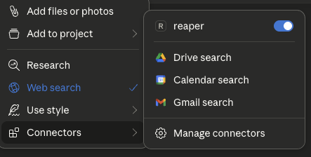
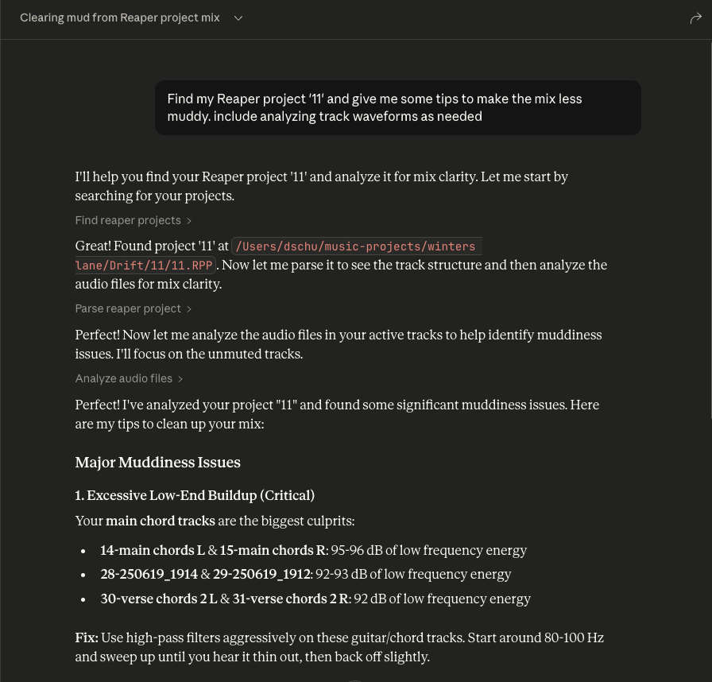

# Reaper MCP Server

This is an MCP server that connects Reaper projects to an MCP client like Claude Desktop, enabling you to ask questions about your projects and get comprehensive audio analysis for mixing feedback.

## Tools

### Project Discovery & Parsing

- **`find_reaper_projects`**: Finds all Reaper projects in the directory you specified in the config.
- **`parse_reaper_project`**: Parses a Reaper project file (.RPP) and returns detailed information including tempo, tracks, FX chains, and audio items.

These tools work in tandem. When you ask Claude a question about a specific Reaper project, it will use the `find_reaper_projects` tool to find the project, then use the `parse_reaper_project` tool to parse the project and answer your question.

### Installed FX Discovery

- **`list_installed_fx(plugin_type=None, search_query=None)`**: Lists all installed FX/plugins available in Reaper.

  **Parameters:**
  - `plugin_type` (optional): Filter by plugin type (VST2, VST3, AU, JS, CLAP)
  - `search_query` (optional): Search plugins by name, manufacturer, or type

  **Returns:** List of installed plugins including:
  - Plugin name
  - Plugin type (VST2, VST3, AU, JS, CLAP)
  - File path
  - Manufacturer (when available)

  **Example Questions:**
  - "What synth plugins do I have installed?"
  - "Show me all my Waves plugins"
  - "I'm looking for a warbly synth. What options do I have from my already installed plugins?"
  - "List all my VST3 plugins"
  - "Do I have any reverb plugins?"
  - "What iZotope plugins do I have?"
  - "Show me all my Audio Unit plugins"

  **Note:** This tool scans your Reaper plugin cache files. If you recently installed new plugins and haven't scanned them in Reaper yet, they won't appear in the results. Make sure to open Reaper and let it scan for new plugins first.

### Audio Analysis

- **`analyze_audio_files(project_path, track_filter=None)`**: Analyzes all audio files in a Reaper project for mixing feedback.

  **Parameters:**
  - `project_path` (required): Path to the .RPP project file
  - `track_filter` (optional): Filter tracks by name (e.g., "Vocal" to analyze only vocal tracks)

  **Returns:** Comprehensive audio analysis including:

  - **Level Analysis**: Peak levels, RMS, clipping detection
  - **Frequency Analysis**: Spectral content, energy distribution across frequency bands
  - **Stereo Imaging**: Stereo width, phase coherence, mono compatibility
  - **Dynamic Range & Loudness**: LUFS (loudness standards), true peak, crest factor

  **Example Questions:**
  - "Analyze all audio in my Rock Song project"
  - "Check the vocal tracks for clipping"
  - "Is my mix too loud for streaming platforms?"
  - "Are there any phase issues in my drum tracks?"

  **Warning Thresholds:**
  - Peak > -0.3 dBFS: Risk of clipping
  - Clipping detected: Digital distortion present
  - Excessive low frequency energy (> -6 dB): Muddy mix
  - Phase coherence < 0.5: Phase cancellation issues
  - LUFS > -8: Too loud for streaming (Spotify target: -14 LUFS)
  - Crest factor < 6 dB: Possibly over-compressed

To see all data structures parsed from projects, check out the `src/reaper_mcp_server/reaper_dataclasses.py` file.

## Setup

1. **Install Dependencies**
   ```bash
   uv venv
   source .venv/bin/activate

   uv pip install .
   ```

2. **Configure Claude Desktop**
   - Follow [the instructions to configure Claude Desktop](https://modelcontextprotocol.io/quickstart/server#core-mcp-concepts) for use with a custom MCP server
   - Find the sample config in `setup/claude_desktop_config.json`
   - Update the following paths in the config:
     - Your `uv` installation path
     - Your Reaper project directory
     - This server's directory

3. **Launch and Configure**
   - Open Claude Desktop
   - Click the '+' icon on the chat box
   - Click on 'Connectors' and you should see the 'reaper' connector enabled

   

4. **Ask Away!**
   - Ask questions about your Reaper project
   - Always include the name of the specific Reaper project you're asking about
   - You can expand the tool boxes to see the raw project data being passed to Claude
   
