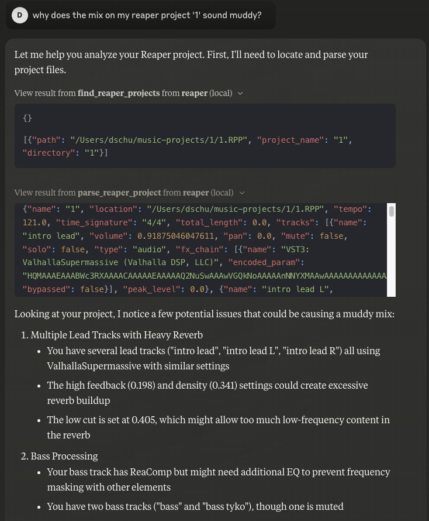

# Reaper MCP Server

This is a simple MCP server that connects a Reaper project to an MCP client like Claude Desktop and enables you to ask questions about the project.

## Tools

- `find_reaper_projects`: Finds all Reaper projects in the directory you specified in the config.
- `parse_reaper_project`: Parses a Reaper project and returns a JSON object.

These tools work in tandem. When you ask Claude a question about a specific Reaper project, it will use the `find_reaper_projects` tool to find the project, then use the `parse_reaper_project` tool to parse the project and answer your question. To see all data that is parsed from the project, check out the `src/domains/reaper_dataclasses.py` file.

## Setup

1. Follow [the instructions to configure Claude Desktop](https://modelcontextprotocol.io/quickstart/server#core-mcp-concepts) (or another MCP client) to use a custom MCP server. A sample config for this project is provided in `setup/claude_desktop_config.json`, but you'll need to adjust the path to your `uv` installation, your Reaper project directory, and this server's directory.

2. Open Claude Desktop and ask a question. You should provide the name of the Reaper project you want to ask about. It will can find any project in the directory you specified in the config.

When you open Claude Desktop, you should see a hammer icon in the bottom right of your chat box. Click on that and you should see the two registered Reaper tools available.

Once you see the tools, ask away! You're able to expand the boxes to see the data getting pulled from your Reaper project and passed to the LLM.

